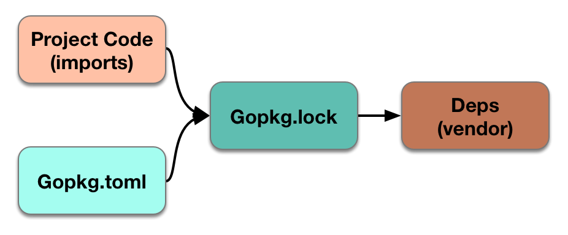

# Dep(Golang的依赖管理工具)

dep是Go的原型依赖管理工具。 它需要Go 1.8+版本。

dep是官方的实验工具，但还不是官方工具.

## 当前状态

Dep需要用于安全的生产,意味着它具备以下两件事情:
- 任何有效的元数据文件(Gopkg.tomi和Gopkg.lock)都是可读的,并被任何未来版本的dep认为有效.
- CLI UI很有可能是稳定的,dep init和dep ensure很有可能是稳定的,dep status很有可能发生改变,dep prune将来会被添加到dep ensure。

也就是说,你需要记住以下几点：

- dep init 在现有的项目上可能是一个比较艰难的选择--我们试图从其他工具的元数据文件中自动转换,而这个过程往往是复杂和模糊的.一旦你的项目被转换,你使用dep ensure它的行为就会相对稳定的。
- dep总的来说还有不少令人讨厌的错误,但是总的来说,这些与其他工具相比还是比其他工具少.
- dep现在运行很慢,特别是你在刚开始运行的前几次.但是我们知道有很大的改进余地,工作正在积极进行
- dep仍然在迅速变化。 如果您需要稳定（例如CI），最好依靠relase版本，而不是tip。
- dep的到处的api借口将继续以不可预知的,向后不兼容的方式进行更改,直到我们v1.0.0版本大发布。

## 设置

从[relase](https://github.com/golang/dep/releases)页面获取最新的二进制文件。

在macOS上，您可以安装或升级到最新发布的自制软件版本：

```shell
$ brew install dep
$ brew upgrade dep
```

要使用dep开始管理依赖关系，请从项目的根目录运行以下命令：

```shell
$ dep init
```
该命令会进行如下操作:

1. 查找现有的依赖关系管理文件进行转换
1. 检查你的依赖关系是否使用dep
1. 确定你的依赖关系
1. 备份现有的vendor/目录(如果有的话)到_vendor-TIMESTAMP/
1. 为每个依赖选择最高兼容版本
1. 生产Gopkg.toml("manifest")和Gopkg.lock文件
1. 在vendor/目录安装依赖

## 使用

你将会使用一个主要的子命令:dep ensure。ensure首先检查Gopkg.lock是否与Gopkg.toml一致,并在代码中导入.如果检查到任何变化.dep的解释器将会创建一个新的Gopkg.lock.然后,dep检查vendor/的内容是否与Gopkg.lock(如果新的适用就使用新的,否则就使用现有的)一致,并且根据需要重写vendor/使其一致.

从本质上讲，ensure两个阶段的工作保持四个状态桶同步：


注意：在我们确保vendor验证之前，我们无法高效地执行Gopkg.lock < - >vendor/比较，因此dep ensure无条件地重新生成所有vendor/以确保安全。

dep ensure是安全，可以经常及早运行。 有关更详细的使用说明，请参阅帮助文本。

```shell
$ dep help ensure
```

### 安装依赖

如果你的vendor/目录没有check in你的代码

```shell
$ dep ensure
```

如果您的vendor/文件夹中已经存在依赖关系，则dep将确保它与清单中的约束匹配。 如果vendor/中缺少依赖关系，则会安装清单所允许的最新版本。

### 添加一个依赖

```shell
$ dep ensure -add github.com/foo/bar
```

这会为您的Gopkg.toml添加一个版本约束，并更新Gopkg.lock和vendor/。 现在，导入并使用你的代码包！

dep ensure -add具有一些细微的行为变化，取决于命名的项目或包，以及树的状态。 有关更多信息，请参阅dep ensure -examples。

### 更改依赖

如果你想:
- 更改允许的目录 version/branch/revision
- 切换到使用fok.

对于一个或多个依赖关系，请执行以下操作：

1. 手动修改你的Gopkg.toml文件
2. 执行: dep ensure

### 校验依赖的状态

执行dep status可以查看你所有依赖的当前状态

```shell
$ dep status
PROJECT                             CONSTRAINT     VERSION        REVISION  LATEST
github.com/Masterminds/semver       branch 2.x     branch 2.x     139cc09   c2e7f6c
github.com/Masterminds/vcs          ^1.11.0        v1.11.1        3084677   3084677
github.com/armon/go-radix           *              branch master  4239b77   4239b77
```

最重要的是，如果您已经将新的导入添加到您的项目中，或者修改了Gopkg.toml而没有运行dep ensure，那么dep status会告诉您Gopkg.lock与项目当前状态之间存在不匹配。

```shell
$ dep status
Lock inputs-digest mismatch due to the following packages missing from the lock:

PROJECT                         MISSING PACKAGES
github.com/Masterminds/goutils  [github.com/Masterminds/goutils]

This happens when a new import is added. Run `dep ensure` to install the missing packages.
```

根据dep status建议，运行dep ensure更新你的lock文件。 然后再次运行dep status，然后锁定不匹配应该消失。


### 可视化依赖关系

通过将dep status的输出输出到graphviz来生成依赖关系树的可视表示。

Linux:

```shell
$ sudo apt-get install graphviz
$ dep status -dot | dot -T png | display
```

MacOs

```shell
$ brew install graphviz
$ dep status -dot | dot -T png | open -f -a /Applications/Preview.app
```


### 更新依赖

update将Gopkg.lock和vendor/中的依赖项的版本带入Gopkg.toml中约束所允许的最新版本。
您只能更新依赖项的目标子集（推荐）：

```shell
$ dep ensure -update github.com/some/project github.com/other/project
$ dep ensure -update github.com/another/project
```

“laster”意味着不同的事情取决于使用的约束类型。 如果你依赖branch，dep会更新到该分支的最新tip。 如果您使用的是某个版本范文，则会更新到该范围的最新版本。

### 删除依赖

1. 从您的代码中删除import和所有用法。
1. 从Gopkg.toml中删除[[constraint]]规则（如果有的话）。
2. 运行dep ensure

### 测试对依赖项的更改

不建议直接在vendor/目录中进行更改，因为dep会覆盖所有更改。 代替：

1. 从vendor /目录中删除依赖项。

	```shell
    $ rm -rf vendor/<dependency>
    ```
2. 如果它不是已经存在的，那么把这个依赖关系添加到你的GOPATH中。

	```shell
    $ go get <dependency>
    ```

1. 修改$ GOPATH/src/<dependency>中的依赖项
2. 测试,构建等

在你完成之前不要运行dep ensure基于您的清单重新安装依赖到vendor/，就像你从头开始安装。

这个解决方案适用于短期使用，但是对于长期的情况，请看一下virtualgo。

要测试已经作为新版本推送的代码或分支或fok，请参阅更改依赖关系。

### Versioning语法

dep ensure使用外部的semver库来解释您在清单中指定的版本约束。 比较运算符是：

- =: 等于
- !=: 不等于
- \>: 大于
- <: 小于
- \>=: 大于或等于
- <=: 小于或等于
- \-: 文本范围.例如： 1.2 - 1.3.5等于>=1.2并且<=1.3.5
- ~: minor范围。 例如: ~1.2.3等于>=1.2.3并且<1.3.0
- ^：major范围。例如: ^1.2.3等于>=1.2.3并且<2.0.0
- [xX*]: 通配符. 例如1.2.x 等于>=1.2.0并且<1.3.0

例如，你可以在你的清单中包含一个约束来指定version =“= 2.0.0”来依赖2.0.0版本，或者使用version =“2.*”约束到minor版本。 有关更多信息，请参阅[semver库文档](https://github.com/Masterminds/semver)。
> 当你指定一个没有操作符的版本时，dep默认会自动使用^操作符。 确保将给定的版本解释为范围的最小边界，例如：
- 1.2.3会变成范围>=1.2.3,<2.0.0
- 0.2.3会变成>=0.2.3, <0.3.0
- 0.0.0会变成>=0.0.3,<0.1.0