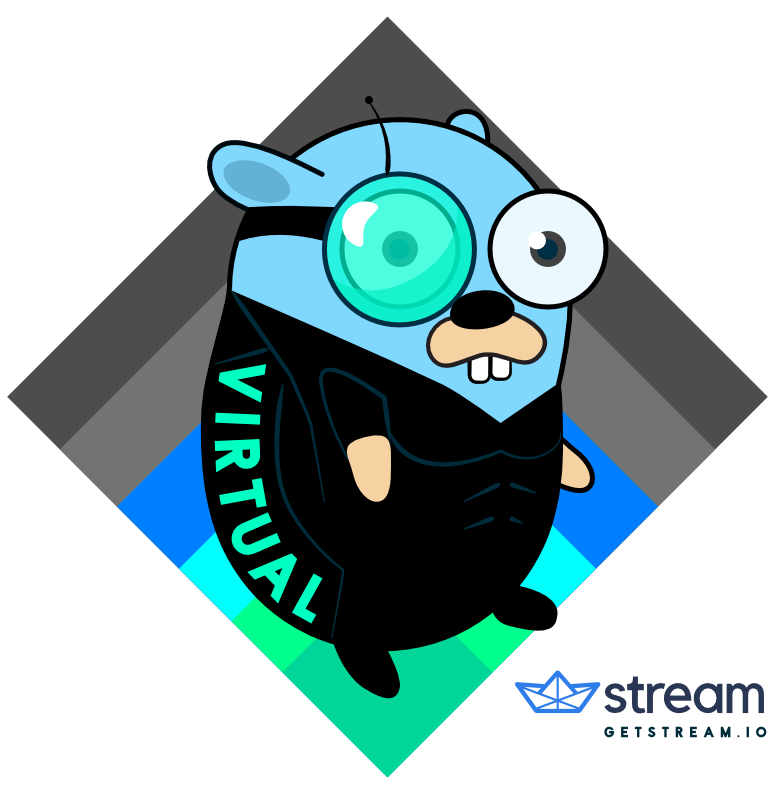

# Virtualgo



Virtualgo（或简称vg）是为Go提供基于工作空间的开发工具。 其主要功能集使其比其他解决方案更好，如下所示：

- 极易使用
- 不干扰其他工具
- 导入固定的版本
- 固定可执行文件的版本,入linters(例如[errcheck](https://github.com/kisielk/errcheck))和codegen工具(例如[protoc-gen-go](https://github.com/golang/protobuf))
- 导入工作区以外的本地检出的依赖项(也称为多项目工作流)
- 可选的完全隔离导入


Virtualgo不会执行依赖关系解析或版本固定，因为这是一个已经被其他工具解决的难题。 其方法是建立在这些工具之上，比如dep，以提供上面列出的功能特性。 对于来自Python vg的人来说，与virtualenv非常相似，dep对应是pip。 主要区别在于vg比virtualenv更容易使用，因为使用vg几乎不需要动脑。

## 使用例子

下面是一个显示vg的一些基本用法的例子。 有关更多信息和示例，请参阅更多信息和vg help。

```shell
$ cd $GOPATH/src/github.com/GetStream/example
$ vg init  # initial creation of workspace

# Now all commands will be executed from within the example workspace
(example) $ go get github.com/pkg/errors # package only present in workspace
(example) $ vg ensure  # installs the dependencies of the example project using dep
(example) $ vg deactivate

$ cd ~
$ cd $GOPATH/src/github.com/GetStream/example
(example) $ # The workspace is now activated automatically after cd-ing to the project directory
```

### 优先于现有解决方案

显而易见的问题是：为什么你应该使用vg？ 它带来了什么好处，你现在用什么？ 这显然取决于你现在使用的是什么工具.
- 当您进入目录时自动激活GOPATH。
- 与诸如dep和glide等版本管理工具的集成允许重复生成。
- 有用的命令来管理安装的软件包 例如，从其他GOPATH卸载软件包或安装本地软件包。

#### 优先于vendor目录

1. 您可以固定可执行依赖项的版本，例如linting和代码生成工具。
2. 在使用1.8或更低的版本时在vendor目录中运行test会有很多问题,而vg运行go test ./..不会有。
3. 您可以轻松地在您的工作区内使用全局GOPATH中的依赖项，而不会导致混淆的导入错误。
4. 它有可选的完全隔离（full isolation）功能。 如果启用，则不会意外回退到常规GOPATH，从而导致您正在使用的软件包版本混淆。
5. 使用完全隔离时，IDE等工具可以在索引上花费更少的时间。 这只是因为他们不需要在工作区之外索引包。
6. 使用https://github.com/akutz/gpd插件时没有更多的烦恼.

#### 优先于手动管理多个GOPATH

- 当您进入目录时自动激活GOPATH。
- 与诸如dep和glide等版本管理工具的集成允许重复生成。
- 有用的命令来管理安装的软件包 例如，从其他GOPATH卸载软件包或安装本地软件包。

## 安装

安装它的包:

```shell
$ go get -u github.com/GetStream/vg
```

建议安装[bindfs](http://bindfs.org/),尽管这个不是硬性要求.bindfs在使用完全隔离(full isolation)和使用vg localInstall时提供了最好的体验。 如果安装了它，不要从〜/.virtualgo手动删除东西。 只能使用vg destroy 或 vg uninstall，否则会丢失数据。

```shell
# OSX
brew install bindfs
# Ubuntu
apt install bindfs
# Arch Linux
pacaur -S bindfs  # or yaourt or whatever tool you use for AUR
```

#### 自动shell配置

您可以运行以下命令来自动配置所有支持的shell：

```shell
vg setup
```

然后重新加载你的shell配置文件：

```shell
source ~/.bashrc                   # for bash
source ~/.zshrc                    # for zsh
source ~/.config/fish/config.fish  # for fish
```

#### 手动shell配置

你也可以手动编辑你的shell配置文件。 之后，您仍然需要像上面解释的那样重新加载文件。

```shell
#~/.bashrc
command -v vg >/dev/null 2>&1 && eval "$(vg eval --shell bash)"
或
#~/.zshrc
command -v vg >/dev/null 2>&1 && eval "$(vg eval --shell zsh)"
或
#~/.config/fish/config.fish
command -v vg >/dev/null 2>&1; and vg eval --shell fish | source
```

## 使用

以下命令是使用vg的主要命令：
```shell
# 要使用的第一个命令是创建并激活以当前direcory命名的工作空间的命令
$ cd $GOPATH/src/github.com/GetStream/example
$ vg init
# 此命令还将当前目录链接到创建的工作区。 这样下一次你cd到这个目录时，工作区会自动激活。 （请参阅下面的自述文件，了解如何使用IDE中的工作区）

# 这个shell中的所有go命令现在都在工作区内执行。 以下将在工作区内安装眼镜蛇命令和库的最新版本
(example) $ go get -u github.com/spf13/cobra/cobra
(example) $ cobra
......

# 也可以只激活一个工作区，而不是将其链接到当前目录。 如果工作空间不存在，它也将在运行中创建。 激活一个新的工作区会自动禁用前一个：
(example) $ vg activate example2
(example2) $ cobra
bash: cobra: command not found

# 要停用工作空间，只需运行：
(example2) $ vg deactivate
$ vg activate
(example) $

# 当工作空间处于活动状态时，编译将尝试首先导入从工作空间安装的软件包。 在某些情况下，您可能需要使用安装在全局GOPATH中的软件包版本。 例如，当你在一个依赖关系中修正一个bug并且想要测试这个修复。在这些情况下，你可以很容易地从你的全局GOPATH中安装一个包到工作区中：
(example) $ vg localInstall github.com/GetStream/utils
# 您甚至可以从特定路径安装软件包：
(example) $ vg localInstall github.com/GetStream/utils ~/weird/path/utils

# 您也可以再次从工作区中卸载软件包
(example) $ vg uninstall github.com/spf13/cobra
# NOTE: 目前这只能删除pkg /中的源代码和静态库，而不是可执行文件。 所以cobra命令仍然可用。

# 请参阅以下各节以与依赖管理工具进行集成。
#  而对于所有命令的完整概述只需运行：
(example) $ vg help
# F有关特定命令运行的详细帮助：
(example) $ vg help <command>
```

### 与dep集成

vg与dep完美结合
```shell
# 将Gopkg.lock中的依赖关系安装到您的工作空间而不是vendor目录中
vg ensure

# 将optional传递给`dep ensure`
vg ensure -- -v -update
```

它还扩展了一个安装可执行文件依赖的方法。 vg repo本身使用它来安装go-bindata和cobra命令。 它通过在Gopkg.toml中添加以下内容来完成此操作：

```xml
required = [
    'github.com/jteeuwen/go-bindata/go-bindata',
    'github.com/spf13/cobra/cobra'
]
```

运行vg ensure在添加完成后，在当前工作空间的GOBIN中安装go-bindata和cobra命令。

如果您不想在所需的列表中安装所有软件包，则可以通过在Gopkg.toml中添加以下内容来实现：

```xml
[metadata]
install-required = false
```

您还可以指定安装哪些软件包而不在required列表中：

```xml
[metadata]
install = [
    'github.com/jteeuwen/go-bindata/go-bindata',
    'github.com/golang/mock/...', # supports pkg/... syntax
]
```

## 工作区导入模式

工作空间可以设置为两种不同的导入模式，全局回退(global fallback)或完全隔离(full isolation)。 工作空间的导入模式决定了如何从代码导入行为，并在创建工作空间时选择导入模式。

### Global fallback

在全局回退模式下，当在工作空间中找不到包时，将从原始GOPATH导入包。 这是新创建的工作区的默认导入模式，因为这会干扰现有的工具。

### Full isolation

在完全隔离模式下，软件包导入将只在工作区内安装的软件包中搜索。 这有一些优点：

- 像IDE这样的工具不需要在全局GOPATH中搜索导入，这会导致索引等操作的显着加速。
- 你总是知道一个导入的包的位置。
- 不可能意外地导入一个不属于您所选vendor工具管理的包。

但是，完全隔离工作区也有一些缺点。 这些都是由于你实际工作的项目不在你的GOPATH之内。 所以通常不会找到任何进口。 这部分通过local install安装项目到您的工作区，但它并没有解决所有问题。

在下面的章节中将会介绍剩余的问题，您可以自行决定上述优点是否值得。 如果您想尝试完全隔离，则可以使用--full-isolation标志创建一个新的工作空间：

```xml
$ vg init --full-isolation
# To change an existing workspace, you have to destroy and recreate it
$ vg destroy example
$ vg activate example --full-isolation
```

这将导致工作空间在未来每次激活时都使用完全隔离导入模式。 因此，之后不需要在每次激活时指定--full-isolation标志。

### 没有安装bindfs

如果未安装bindfs，则将使用符号链接进行local install。 这与bindfs描述的问题相同，但也有一些额外的问题不能轻松解决。 原因是go工具不象GOPATH中的符号链接(https://github.com/golang/go/issues/15507,https://github.com/golang/go/issues/17451)

编译将仍然有效，但是去列表github.com/...将不会列出您的软件包。 除此之外，使用delve[＃11](https://github.com/GetStream/vg/issues/11)也有问题。 由于这些问题，不建议在没有安装bindfs的情况下以完全隔离模式使用virtualgo。

## 使用带有虚拟工作区的IDE

由于virtualgo只是一个可用性包装器，可以用来改变特定项目的GOPATH，所以将它与IDE结合使用通常很容易。 激活工作空间后，只需检查GOPATH并相应地配置IDE即可。 通常如果你显示你的GOPATH，你会看到两个用冒号分隔的路径：

```shell
$ echo $GOPATH
/home/stream/.virtualgo/myworkspace:/home/stream/go
```

如果你可以直接设置这个完整的字符串,你是提倡的. 对于[GoLand](https://www.jetbrains.com/go/)，你必须先添加第一个，然后再添加第二个。

在完全隔离模式下使用工作区时，由于只有一个GOPATH集，因此更容易设置。

```shell
$ echo $GOPATH
/home/stream/.virtualgo/myworkspace
```
